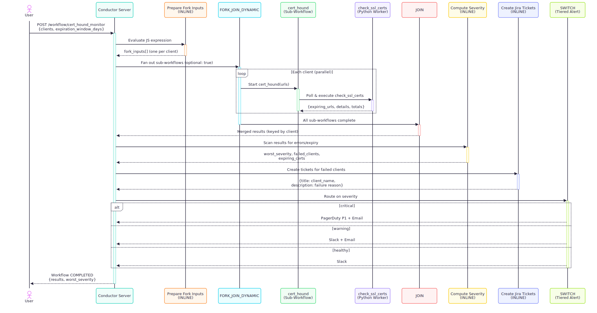

# CertHound

A [Conductor](https://github.com/conductor-oss/conductor)-powered workflow that fans out SSL certificate checks across multiple clients in parallel, flags expiring or broken certs, and routes alerts by severity (critical → PagerDuty + Email, warning → Slack + Email, healthy → Slack).

## Architecture



**Worker:**
- `check_ssl_certs` — connects to each URL over TLS, reads the certificate, and reports expiry date / days remaining. Failed clients show as FAILED sub-workflows in the Conductor UI while the parent workflow continues (`optional: true` on the fork).

## Prerequisites

- Python 3.10+
- Node.js >= 14
- [Conductor CLI](https://www.npmjs.com/package/@conductor-oss/conductor-cli):
  ```bash
  npm install -g @conductor-oss/conductor-cli
  ```

## 1. Start the Conductor Server

```bash
conductor server start
```

Wait for the server to be ready (default: `http://localhost:8080`). You can verify with:

```bash
conductor server status
```

Or hit the API directly:

```bash
curl http://localhost:8080/health
```

## 2. Register Task Definitions and Workflows

Register the task definition first, then both workflows.

**Using the Conductor CLI:**

```bash
conductor task create workflows/check_ssl_certs_taskdef.json
conductor workflow create workflows/cert_hound_workflow.json
conductor workflow create workflows/cert_hound_monitor_workflow.json
```

To update existing definitions, use `update` instead of `create`:

```bash
conductor task update workflows/check_ssl_certs_taskdef.json
conductor workflow update workflows/cert_hound_workflow.json
conductor workflow update workflows/cert_hound_monitor_workflow.json
```

**Or using curl:**

```bash
# Task definition (API expects an array)
curl -X POST http://localhost:8080/api/metadata/taskdefs \
  -H 'Content-Type: application/json' \
  -d "[$(cat workflows/check_ssl_certs_taskdef.json)]"

# Workflows (API expects an array)
curl -X PUT http://localhost:8080/api/metadata/workflow \
  -H 'Content-Type: application/json' \
  -d "[$(cat workflows/cert_hound_workflow.json)]"

curl -X PUT http://localhost:8080/api/metadata/workflow \
  -H 'Content-Type: application/json' \
  -d "[$(cat workflows/cert_hound_monitor_workflow.json)]"
```

## 3. Install Python Dependencies

```bash
pip install -r workers/requirements.txt
```

## 4. Start the Worker

```bash
python workers/check_ssl_certs_worker.py
```

The worker will begin polling the Conductor server for `check_ssl_certs` tasks.

## 5. Execute the Workflow

Trigger the `cert_hound_monitor` workflow with the sample input.

**Using the Conductor CLI:**

```bash
conductor workflow start -w cert_hound_monitor -f test_monitor_input.json
```

This returns a workflow ID. Check its execution details with:

```bash
conductor workflow get-execution <WORKFLOW_ID>
```

Or run synchronously (blocks until completion):

```bash
conductor workflow start -w cert_hound_monitor -f test_monitor_input.json --sync
```

**Or using curl:**

```bash
curl -X POST http://localhost:8080/api/workflow/cert_hound_monitor \
  -H 'Content-Type: application/json' \
  -d @test_monitor_input.json

curl -s http://localhost:8080/api/workflow/<WORKFLOW_ID> | python -m json.tool
```

### Sample Input

`test_monitor_input.json` ships a multi-client example:

```json
{
  "clients": [
    { "client_name": "Acme Corp", "urls": ["https://expired.badssl.com", "https://google.com"] },
    { "client_name": "Globex",    "urls": ["https://github.com"] },
    { "client_name": "Initech",   "urls": [] }
  ],
  "expiration_window_days": 30
}
```

### Sample Output

```
status: COMPLETED
worst_severity: critical
```

The workflow output contains a `results` object keyed by client with per-URL certificate details, and a `worst_severity` field that drives the tiered alerting.

## Stopping

```bash
# Stop the worker
# Ctrl+C in the terminal, or kill the background process

# Stop the Conductor server
conductor server stop
```
